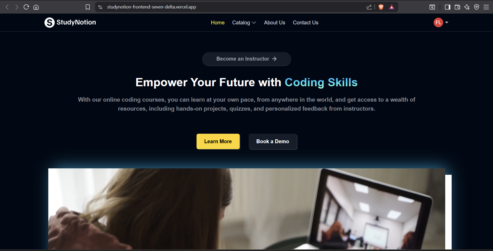
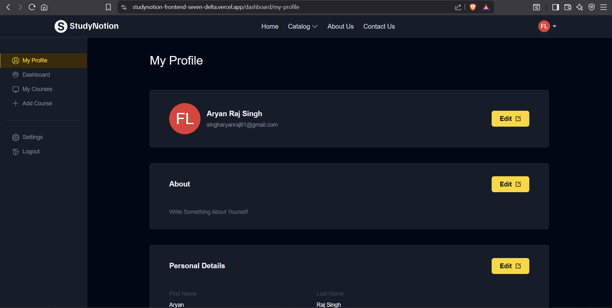

# StudyNotion – Full-Stack EdTech Platform  

[](https://studynotion-frontend-seven-delta.vercel.app/)  
[](https://studynotion-backend-dk2n.onrender.com/)  

**StudyNotion** is a full-stack EdTech platform built with the **MERN stack**, designed to provide an engaging and seamless learning experience.  
It bridges the gap between **students** and **instructors**, enabling instructors to create and manage courses while students can explore, purchase, and track their learning journey.  

---

## ✨ Features  

### 👩‍🎓 For Students
- 🔐 **Secure Authentication** – Signup/login with OTP-based email verification.  
- 📚 **Course Catalog** – Browse, search, and filter courses.  
- 💳 **Payments** – Secure checkout powered by **Razorpay**.  
- 📊 **Student Dashboard** – Track enrolled courses and progress.  
- 🎥 **Video Player** – Interactive course view with progress tracking.  
- ⭐ **Feedback System** – Rate and review enrolled courses.  

### 👨‍🏫 For Instructors
- 📈 **Instructor Dashboard** – View revenue insights and student enrollments.  
- 📝 **Course Management** – Create, edit, and publish courses.  
- 🗂 **Curriculum Builder** – Add sections and sub-sections (video lectures).  
- ☁️ **Media Uploads** – Manage thumbnails and videos with **Cloudinary**.  

---

## 🛠 Tech Stack  

### Frontend  
- React.js  
- Redux Toolkit  
- Tailwind CSS  
- React Hook Form  
- Chart.js  
- Axios  

### Backend  
- Node.js & Express.js  
- Mongoose  
- JSON Web Tokens (JWT)  
- bcryptjs  
- Cloudinary  
- Razorpay  
- Resend / Nodemailer  

### Database  
- MongoDB (MongoDB Atlas)  

### Deployment  
- **Frontend:** Vercel  
- **Backend:** Render  

---

## 🎥 Demo & Screenshots  

### 🔹 Landing Page  
  

### 🔹 Course Catalog  
  

### 🔹 Student Dashboard  
  

### 🔹 Instructor Dashboard  
  

### 🔹 Course Player  
  

### 🔹 Demo Walkthrough  
  

*(Replace these with your actual screenshots and demo GIFs inside an `assets` folder.)*  

---

## 🚀 Installation & Setup  

To run this project locally, follow the steps below:  

### Prerequisites  
- [Node.js](https://nodejs.org/) & npm installed  
- MongoDB running locally **or** a MongoDB Atlas connection string  

### 1. Clone the Repository  
```bash
git clone https://github.com/agasx13/StudyNotion.git
cd StudyNotion

# Install frontend dependencies
cd study-notion
npm install

# Install backend dependencies
cd ../server
npm install


MONGO_URI=your_mongodb_connection_string
JWT_SECRET=your_secret_key
CLOUDINARY_NAME=your_cloudinary_name
CLOUDINARY_API_KEY=your_cloudinary_api_key
CLOUDINARY_API_SECRET=your_cloudinary_api_secret
RAZORPAY_KEY=your_razorpay_key
RAZORPAY_SECRET=your_razorpay_secret
RESEND_API_KEY=your_resend_api_key


# Start backend
cd server
npm run dev

# Start frontend
cd ../study-notion
npm start
